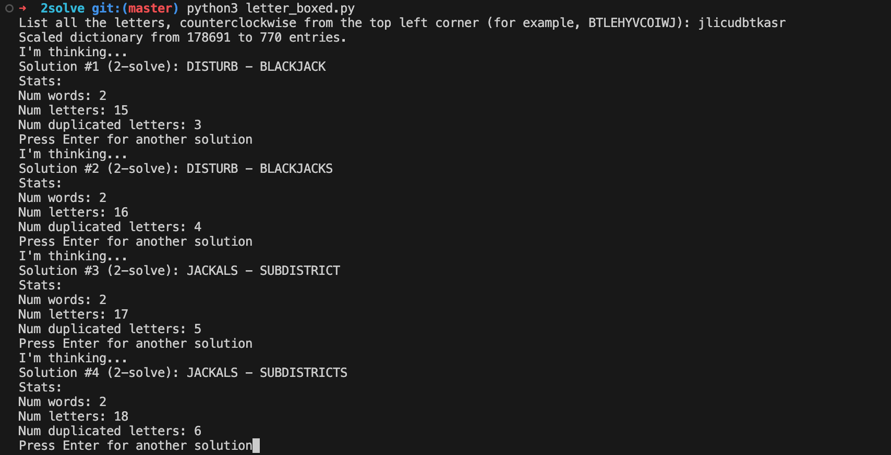

# 2solve

Solver for the "Letter Boxed" puzzle game from the New York Times ([https://www.nytimes.com/puzzles/letter-boxed](https://www.nytimes.com/puzzles/letter-boxed))

Usage:
```
python3 letter_boxed.py
```
And follow the interactive prompts.

This solver produces the best results first, and can produce a 2-solve almost immediately. 



The "best" result:
- Is a series of words that uses all the letters in the box (aka, a solution).
- Uses the minimal number of words to solve the puzzle
- Uses the minimal number of total letters to solve the puzzle

It takes longer to produce solutions of longer length because the solver explores possible solutions in order of quality.

> [!NOTE]
> The dictionary file included is a Scrabble dictionary, different from the one used by NYT. It's generally bigger, so it may return some answers with unplayable words, but some words are missing from it that are considered words in the NYT dictionary.
